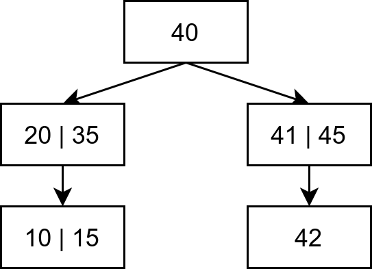
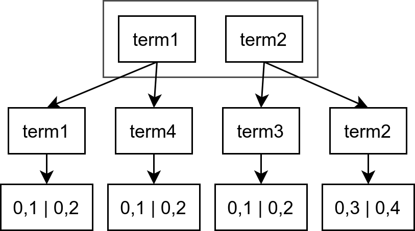
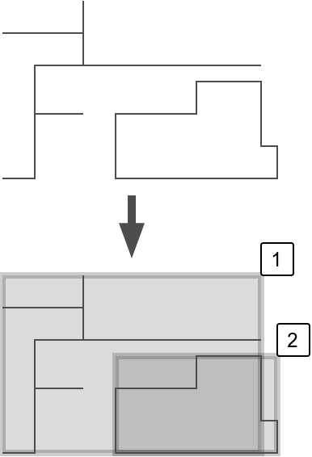
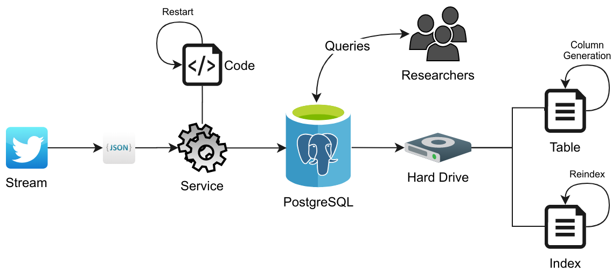

## A Geo-social Media Database for COVID-19 Research

Richard Wen
<br>rwen@ryerson.ca
<br>March 31, 2020

---

## Coronavirus (COVID-19)

<iframe src="viz/globe.html" width="100%" height="550px"></iframe>

---

# Recent Issues

<!-- .slide: data-background="black" data-background-transition="fade" -->

---

## Public Health

<div class="tweet" data-src="https://twitter.com/CPHO_Canada/status/1243720771727503373"></div>

---

<div class="tweet" width="100%" height="450px" data-src="https://twitter.com/AndrewConstance/status/1241872088249413632"></div>

---

## Health Care

<div class="tweet" data-src="https://twitter.com/680NEWS/status/1243636056504905729"></div>

---

<iframe src="https://ourworldindata.org/grapher/hospital-beds-per-1000-people?tab=chart" style="width: 100%; height: 600px; border: 0px none;"></iframe>

---

## Misinformation

<div class="tweet" data-src="https://twitter.com/CP24/status/1243491116974051329"></div>

---

## Location

<iframe src="https://ourworldindata.org/grapher/covid-confirmed-cases-since-100th-case" style="width: 100%; height: 450px; border: 0px none;"></iframe>

---

# The Idea

<!-- .slide: data-background="black" data-background-transition="fade" -->

---

<!-- .slide: data-background-iframe="https://www.omnisci.com/demos/tweetmap" data-background-interactive -->

---

## Objectives

1. Develop a real-time Twitter geo-spatial database
2. Optimize data for selected filters
3. Optimize data for spatial queries

---

# Database Considerations

<!-- .slide: data-background="black" data-background-transition="fade" -->

---

## Twitter Stream (Mar. 4)

* ~1% of tweets
* ~50-2000 tweets/sec.
* ~3 million tweets/day

---

## Keywords

* COVID-19
    * e.g. #COVID19, #nCov2019, coronavirus
* Social distancing
    * #socialdistancing, #physicaldistancing

---

## Est. Records (Millions)

<div class="plot" id="tweetplot" style="background-color:#fff; width:800px; height:400px; margin: 0 auto;">
<!--
{
 "target":"#tweetplot",
 "height":400,
 "width":"800",
 "xAxis":{"domain":[0,45],"label":"Days"},
 "yAxis":{"domain":[0,150],"label":"Records"},
 "grid":true,
 "data":[{"fn":"3x","color":"teal"}]
}
-->
</div>

---

## Needs

1. Handle thousands of `INSERTS` / sec.
2. Fast complex queries
    * e.g. < 10 seconds / 1000 records
3. Many concurrent users in research environment

---

## PostgreSQL Database

* Relational database
* Geo-spatial support
* Unstructured and structured data

---

# Data Cleaning

<!-- .slide: data-background="black" data-background-transition="fade" -->

---

### JavaScript Object Notation (JSON)

```
{
    "id": ...,
    "lang": "en",
    "text": ...,
    "user": {
        "id": ...,
        ...
    },
    "place": {...},
    ...
    "created_at": "Wed Mar 25 23:27:47 +0000 2020",
    "coordinates": {...},
    "place": null
}
```

---

## Column Generation

```
{"id": 1, 
 "geometry: {...
        coordinates: [-90.1234,40.1234]
    }, 
  "created_at": "Wed Mar 25 23:27:47 +0000 2020"}
```

| tweet_id | tweet_geometry | tweet_timestamp |
|----------|----------------|-----------------|
| NUMERIC  | GEOMETRY       | TIMESTAMP       |

---

## Indexing

Avoid sequential scans

<div class="plot" id="btreeplot" style="background-color:#fff; width:100%; height:350px; margin: 0 auto;">
<!--
{
 "target":"#btreeplot",
 "height":400,
 "width":"800",
 "xAxis":{"domain":[0,10],"label":"n"},
 "yAxis":{"domain":[0,10],"label":"Time"},
 "grid":true,
 "data":[
    {"fn":"log(x)","color":"teal"},
    {"fn":"x","color":"red"}
]}
-->
</div>

---

## Balanced Tree (BTREE)



---

### Generalized Inverted Index (GIN)



---

### Generalized Search Tree (GIST)



---

# Current Work

<!-- .slide: data-background="black" data-background-transition="fade" -->

---

## Architecture



---

## Available Data

* 48 generated columns
    * ids, text, geometries, users, retweets
    * text, geometry, timestamps indexed
* \> 80 million tweets
* ~500ms for small queries (100 to 1000 rows)

---

# Next Steps

<!-- .slide: data-background="black" data-background-transition="fade" -->

---

## Limitations

* Data migration allocates resources
* Slow hard drive speed
* Slow maintenance on large table

---

## Future Work

* Optimize for select user queries
* Switch to Solid State Drive (SSD)
* Partition table on weekly basis
* Dashboard and analyses

---

### Thanks - Stay Safe and Healthy!

Richard Wen<br>
rwen@ryerson.ca
